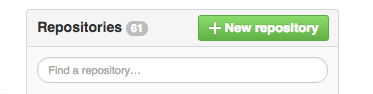

include::../../header.adoc[]

Un *Versioning Control System* (VCS) permet de stocker tous ses fichiers : code, configuration, scripts...

NOTE: C'est le coffre fort d'une équipe de développement.

Il permet d'accéder à tout l'historique du projet.

*git* semble avoir pris le pas sur tous les autres systèmes.

.DVCS
****
git est un *Distributed VCS* et suit donc une philosophie particulière.

Il permet de travailler sur des *branches* locales ou distantes.
Cela permet de *commiter* en local avant de *pousser* vers le serveur.

Cela permet à beaucoup de personnes de travailler simultanément sur plusieurs sujets en parallèle.

L'exemple classique est le https://github.com/torvalds/linux[noyau linux, window="_blank"].
****

Il permet de répondre à des organisations complexes avec des développeurs tout autour du monde.

En pratique, il est aussi parfaitement utile au sein de l'entreprise, pour une petite équipe.

== Compte github

image:github.png[40, 40] https://github.com/[Github] est un site web qui propose une interface web communautaire par dessus git. Github est gratuit pour les projets open source et simple à utiliser. Cela en fait un outil de référence pour les projets open source.

C'est l'outils que nous allons utiliser pour notre projet.

.Rachat par Microsoft
****
Github a été récemment acheté par Microsoft.

Il est difficile de dire si les projets, notamment open source, vont fuir la plateforme.
Github héberge par exemple des projets Google.

Il existe au moins une alternative, moins riche : https://about.gitlab.com/[GitLab, window="_blank"].
****

⇰ Créez un compte github et configurez une clée ssh en suivant le https://help.github.com/articles/generating-ssh-keys/[tutorial github, window="_blank"]

Pour les malheureux possesseurs de Windows, il est possible d'installer git (dont git bash) https://gitforwindows.org/

.Clé SSH
****
L'authentification par clé fonctionne grâce à 3 composants :

*   Une clé publique : elle sera exportée sur chaque hôte vers lequel on souhaite pouvoir se connecter.
*   Une clé privée : elle permet de prouver son identité aux serveurs.
*   Une passphrase : Permet de sécuriser la clé privée (notons la subtilité, passphrase et pas password... donc « phrase de passe » et non pas « mot de passe »).

source http://doc.fedora-fr.org/wiki/SSH_:_Authentification_par_clé
****

== Repository 'test-project'

⇰ Depuis le dashboard, créez un repository *test-project*.

On doit donc obtenir un repository de la forme `git@github.com:{user}/test-project.git`

On peut choisir un autre nom pour le repository. Dans ce cas, il faut adapter pour toutes les manipulations à venir.

== Commandes en local

=== git init

⇰ Nous créons le répertoire du projet en local

[source.terminal]
----
projects$ mkdir test-project
projects$ cd test-project
test-project$
----

⇰ Afin de pouvoir commiter en local, il faut d'abord initialiser notre répertoire projet.

[source.terminal]
----
test-project$ git init
Initialized empty Git repository in /path/to/projects/test-project/.git/
----

=== .gitignore

⇰ Certains fichiers ne doivent pas être versionnés et envoyés vers le serveur git :

* les fichiers générés lors du build
* les fichiers de configuration de l'IDE
* ...

On crée le fichier *.gitignore* à la racine du projet afin de les exclure.

[source.terminal]
----
# gradle
.gradle <1>
build <2>

# intellij <3>
.idea
.iml
----
<1> répertoire de travail associé à notre outil de build
<2> résultat de la compilation et autres fichiers générés lors du build
<3> définition du module sous intellij

Il faudra ajouter d'éventuels autres patterns si le besoin se présentait.

=== git add

La commande `git status` doit donc afficher à peu près cela.

[source.terminal]
----
test-project$ git status
# On branch master <1>
#
# Initial commit
#
# Untracked files:
#   (use "git add <file>..." to include in what will be committed) <2>
#
#       .gitignore
nothing added to commit but untracked files present (use "git add" to track)
----
<1> nous sommes sur la branche locale 'master'
<2> il y a souvent de l'aide à la suite des commandes git

⇰ On ajoute donc notre fichier et on fait notre premier commit.

[source.terminal]
----
test-project$ git add .gitignore
test-project$ git commit -m "initial commit" <1>
----
<1> L'option -m permet de définir le message du commit

=== git remote add

⇰ Afin de pouvoir pousser vers le serveur distant, il nous reste donc à relier notre master local au origin/master de github

[source.terminal]
----
test-project$ git remote add origin git@github.com:{user}/test-project.git
----

=== git push

⇰ Afin d'envoyer les fichiers vers github, on utilise la commande `push`

[source.terminal]
----
test-project$ git push origin master
----

Les fichiers sont maintenant sur le repository github.

⇰ Afin de simplifier les push et les pull, on peut ajouter un lien par défaut entre le master local et le master sur origin.

[source.terminal]
----
test-project$ git config branch.master.merge refs/heads/master
----

Maintenant `git push` et `git pull` feront automatiqment le lien avec origin. La commande de push devient donc simplement :

[source.terminal]
----
test-project$ git push
----

=== git pull

`git pull` est la commande opposé de `git push`. Elle permet de récupérer les modifications depuis le serveur distant vers son poste.

.Pour aller plus loin
****

Les systèmes de versioning viennent avec leur complexité mais sont *OBLIGATOIRES*

git offre beaucoup de richesse que l'on découvre au fil du temps.

Le système décentralisé, nécessaire pour certaines organisations, apporte une complexité initiale difficle à cerner.

http://www.amazon.fr/Pro-Git-Scott-Chacon/dp/1484200772[Pro Git, window="_blank"] est un très bon livre qui couvre tous ces sujets.
****

include::../../footer.adoc[]