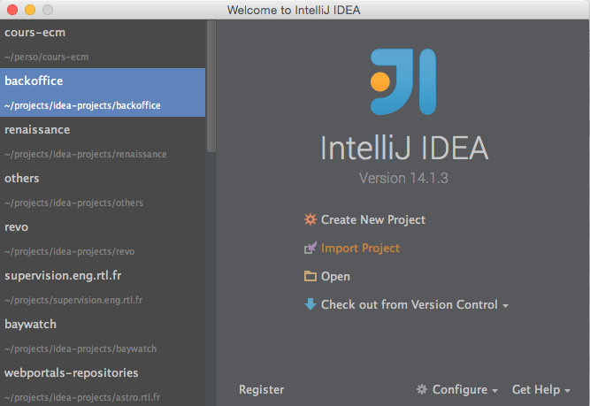
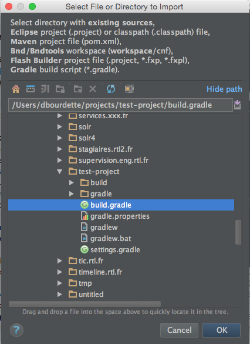
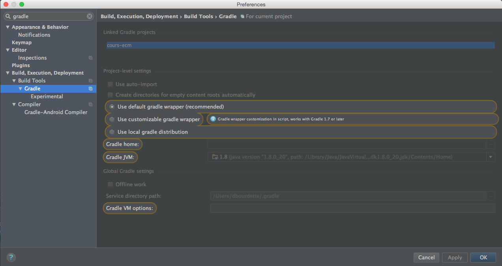

include::../../header.adoc[]

image::banner.png[width=100%]

Un IDE est un environnement complet qui permet de travailler plus vite en regroupant de multiples outils de développement dans une même interface.

.JetBrains
****
Intellij est développé par https://www.jetbrains.com/[JetBrains, window="_blank"] qui maitient tout une suite de logiciels pour divers languages : languages front, php, python, ruby...
****

Intellij existe en 2 versions : *communautaire* et *ultimate*.

* La version *communautaire* est suffisante pour faire du java, du groovy ou du scala.
* La version *ultimate* rajoute le web, jee et d'avantages de languages et plateformes (https://www.jetbrains.com/idea/features/[toutes les features, window="_blank"]).

Intellij ultimate n'est pas gratuit mais ses qualités justifient amplement un tarif qui n'est pas très élevé.

.Alternatives

* *Eclipse* : l'IDE le plus utilisé car il est extrêmement complet et gratuit. Ses nombreux plugins font sa richesse.
* *Netbeans* : c'est l'IDE de référence développé par Oracle. Il est gratuit et suit très bien les spécifications jee. Ce n'est pourtant pas l'environnement de choix pour les utilisateurs avancés.

Nous allons intégrer notre projet naissant dans Intellij

.Eclipse vs Intellij vs NetBeans
****
On choisit tous, plus ou moins, son language, son environnement, ses outils et toutes ses choses qui impactent notre productivité et notre bonheur à programmer.

Mon expérience est que, malgré les qualités des autres produits, la famille de produits de JetBrains (dont Intellij) reste très supérieure.

A chacun donc son avis, vous avez le mien.
****

== Projets et modules

Un *projet* est la structure de base. C'est tout ce qu'on voit dans la fenêtre.

Il définit un sdk (software development kit) et un niveau de compatibilité du language java (1.7, 1.8...).

Il contient 1 ou plusieurs *modules*. Un module contient des fichiers sources.

Chaque module est indépendant et possède ses fichiers et ses librairies.

== Préférences

[.float-group]
--
image:prefs.png[preferences,width=300px,role=left,title='Préférences',link='prefs.png',window="_blank"]

Les préférences sont accessibles via le menu menu:File[Other settings > Default Settings...]

Elles sont aussi disponibles via l'icône image:settings-icon.png[settings] de la barre d'outils et le raccourçi kbd:[⌘+,]

Elles permettent de régler beaucoup des aspects de l'IDE : formattage des sources, environnement java...
--

[.float-group]
--
image:project.png[project,width=300px,role=left,title='Projet',link='project.png']

La structure du projet est accessible via l'icône .

On peut y voir les librairies utilisées, la configuration des modules, les dépendances...
--

== Création du projet

[.float-group]
--

Au lancement d'Intellij, on choisit 'Import project'
--

[.float-group]
--

Puis on choisit le fichier *build.gradle* de notre test-project
--

[.float-group]
--
image::project-3.png[width=300px,role=left,link='project-3.png']

On laisse tout par défaut pour l'import gradle
--

[.float-group]
--
image::project-4.png[width=300px,role=left,link='project-4.png']

Si tout c'est bien passé, nous avons notre projet avec le module test-project
--

== Mise à jour du build.gradle

A chaque mise à jour du build.gradle (ajout d'une dépendance par exemple), Intellij doit prendre en compte les modifications.

[.float-group]
--

Soit on active la mise à jour automatique 'use auto-import' (j'ai déjà eu quelques soucis avec cette option).
--

[.float-group]
--
image::refresh-gradle.png[width=300px,role=left,link='refresh-gradle.png']

Soit il faut mettre à jour à chaque modification.
--

== Maintenant

Notre projet de test est prêt à recevoir du code.

[source.terminal]
----
test-project $ tree
.
├── build.gradle
├── gradle
│   └── wrapper
│       ├── gradle-wrapper.jar
│       └── gradle-wrapper.properties
├── gradle.properties
├── gradlew
├── gradlew.bat
└── settings.gradle
----

include::../../footer.adoc[]