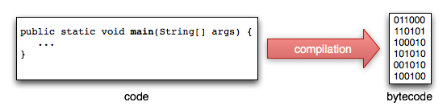

include::../../header.adoc[]

Java est un language objet dont la synthaxe est dérivée du C.

C'est un language *fortement typé* : les contrôles sont effecutés à la compilation.

NOTE: ce document ne contient que quelques rappels et n'est pas du tout exhaustif

== Compilation et bytecode

Les fichiers .java sont compilés en .class qui contiennent du byte code.

Les fichiers .class peuvent être exécuté partout ou il y a une *Java Virtual Machine* (jvm).

.Write once, run anywhere
****
"**Write once, run anywhere**" (**WORA**), or sometimes write once, run everywhere (**WORE**), is a slogan created by https://en.wikipedia.org/wiki/Sun_Microsystems[Sun Microsystems] to illustrate the https://en.wikipedia.org/wiki/Cross-platform[cross-platform] benefits of the https://en.wikipedia.org/wiki/Java_(programming_language)[Java language].^https://en.wikipedia.org/wiki/Write_once,_run_anywhere#cite_note-1[[1]]^^https://en.wikipedia.org/wiki/Write_once,_run_anywhere#cite_note-2[[2]]^ Ideally, this means Java can be developed on any device, compiled into a standard https://en.wikipedia.org/wiki/Bytecode[bytecode] and be expected to run on any device equipped with a https://en.wikipedia.org/wiki/Java_virtual_machine[Java virtual machine] (JVM). The installation of a JVM or Java interpreter on chips, devices or software packages has become an industry standard practice.

source https://en.wikipedia.org/wiki/Write_once,_run_anywhere
****

La commande `javac` de compilation fait partie du *Java Development Kit* (JDK).

[source.terminal]
----
javac -classpath lib1.jar;lib2.jar Hello.java
----

.classpath
****
La jvm va chercher les Classes java nécessaires à l'exécution d'un programme java dans le *classpath*.
****

En pratique, la commande de compilation devient rapidement très complexe. Fort heureusement, c'est l'IDE ou le système de build qui a la charge de générer et piloter celle ci.

== Organisation

=== Packages

Les classes java sont organisées en *packages* (répertoires).

Il est possible d'avoir un même nom de classe dans des packages différents.

=== Import

Un `import` permet d'utiliser une autre classe depuis la classe courante.

Au lancement de l'application, toutes les classes présentes dans le classpath sont disponibles à l'import.

== Types primitifs

Les types primitifs sont byte, short, int, long, float, double, boolean et char.

Tous les autres types sont des objets qui héritent de la classe Object.

== Types objets

Le code est structurée en classes, interfaces, enums et annotations.

=== class

[source,java]
----
public class Person {

}
----

C'est le type qui permet de définir une classe avec ses méthodes et ses attributs (public, protected, private et package)

=== interface

[source,java]
----
public interface Runnable {
  void run();
}
----

Une interface peut définir que des signatures de méthodes publiques, des implémentations par défaut et des constantes. Une classe peut alors 'implémenter' une interface.

[source,java]
----
public class MyClass implements Runnable {
  @Override
  public void run() {
    // code
  }
}
----

L'interface définit généralement un contrat que les classes l'implémentant doivent respecter. L'interface ne se soucie des détails de l'implémentation.

.Java 8 et les interfaces
****
Il existe 2 nouveautés en java 8 pour les interfaces :

* on a le droit d'y écrire des méthodes statiques,
* une méthode indiquée comme `default` peut contenir du code.
****

=== enum

[source,java]
----
public enum Gender {
  MALE, FEMALE;
}
----

C'est une liste finie typée. Elle peut contenir des méthodes et des attributs.

=== annotation

[source,java]
----
@Retention(RetentionPolicy.RUNTIME) <1>
@Target(ElementType.TYPE) <2>
public @interface Validate {

}
----
<1> L'annotation sera présente au runtime
<2> Elle est applicable sur des classes

Comme son nom l'indique, elle sert à annoter (marquer) un autre élément, un peu comme un label ou un tag.

[source,java]
.utilisation
----
@Validate
public class MyModel {

}
----

== Méthode main et exécution

L'exécution d'une classe java se fait avec la commande java

[source.terminal]
----
java -classpath lib1.jar;lib2.jar Hello
----

Afin de pouvoir être exécutée, cette classe Hello doit posséder une méthode main avec la signature suivante.

[source,java]
----
public static void main(String[] args) {
    ...
}
----

== stacktrace

Lorsqu'une exception est levée (ex: `throw new IllegalArgumentException('name must be not null')`), le flow d'exécution est arrêté et elle remonte vers l'appelant.

Au moment où elle est levée, l'exception capture la pile d'appels. Il est possible d'afficher cette pile (stacktrace), par exemple :

[source,java]
----
java.io.FileNotFoundException: my_file.txt <1>
        at java.io.FileInputStream.<init>(FileInputStream.java) <2>
        at java.io.FileInputStream.<init>(FileInputStream.java)
        at Main.main(Main.java:19) <3>
----
<1> nous avons une `FileNotFoundException` qui a pour message 'my_file.txt'
<2> la ligne générant cette erreur est dans le constructeur de FileInputStream
<3> nous sommes passé par la méthode main de la class Main à la ligne 19

Cela peut sembler un peu indigeste au départ mais c'est très complet et donc très utile.

== gestion de la mémoire

En java, on ne gère pas la mémoire à la main : nous sommes dans un environnement managé.

La mémoire est segmentée afin d'y répartir les objets chargés.

Des stratégies complexes pilotent les données en mémoire.

image::memory.jpg[align=center]

Le *garbage collector* (GC) surveille les objets devenus inutiles et libère la mémoire correspondante.

== l'évolution du language

En 20 ans, le language à subit beaucoup d'évolutions :

TODO : table avec versions

* java 1.4 (2002)
** assert : assertion
* java 1.5 / 5.0 (2004)
** generiques (List<T>)
** annotations (@Annotation)
** autoboxing / unboxing ex: `Integer i = 10; int j = i;`
** enums
** varargs ex: `public void tags(String... tags)`
** imports statiques ex: `import static org.junit.Assert.assertEquals`
** for each loops ex: `for (String tag : tags) {...}`
* java 6.0 (2006)
* java 7.0 (projet coin)
** strings dans les switch
** notation plus lisible pour les numériques ex: `int value = 100_000;`
** multi catch ex: `try { ... } catch (FirstException | SecondException ex) { ... }`
** opérateur diamant ex: `List<String> values = new ArrayList<>()`
** try with resources ex: `try (Statement stmt = con.createStatement()) { stmt.executeQuery(query); }`
** varargs simplifiés
* java 8.0
** lambdas (closures pour java)
** java date and time API
** default methods sur les interfaces

Malgré ces évolutions, la compatibilité avec les versions passées est très bonne.

== Une plateforme riche et diverse

La richesse de la plateforme est essentiellement due aux librairies issues de la communauté.

Voici quelques exemples :

* http://hibernate.org/[hibernate, window="_blank"]
* https://spring.io/[spring, window="_blank"]
* https://github.com/google/guice[guice, window="_blank"]
* https://lucene.apache.org/core/[lucene, window="_blank"]
* http://www.joda.org/joda-time/[joda time, window="_blank"] qui a inspiré la java date and time API de java 8
* ...

La liste est extrêmement longue, entre innnovation et reprise de ce qui se fait dans les autres languages.

include::../../footer.adoc[]