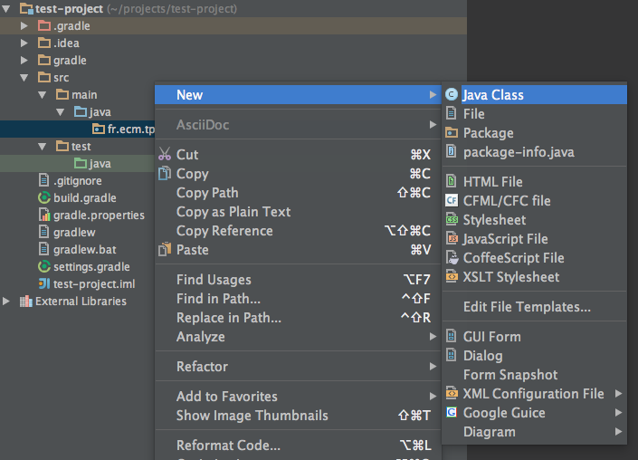
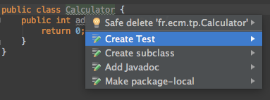
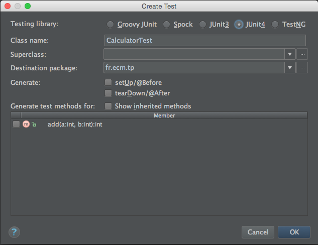
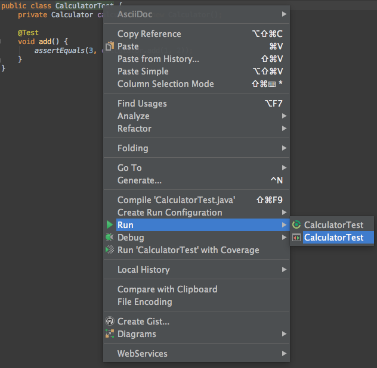

include::../../header.adoc[]

image::banner.png[width=100%]

Le développement par les tests est une technique fondamentale de l'agilité

== Le cycle de développement

=== La boucle d'ajout de fonctionnalité

Voici la boucle immuable du TDD

.Cycle TDD
image::tdd_flow.png[align=center]

=== Avantages

C'est une pratique, au départ, contre intuitive. Elle a de multiple avantages :

* On construit le design au fur et à mesure des tests
* Les APIs résultantes plus claires et plus explicites
* Le code est évidemment testé et on réduit le risque de régression
* En cas de bug, il est plus facile de reproduire et corriger

== jUnit

https://en.wikipedia.org/wiki/Kent_Beck[Kent Beck, window="_blank"] est à l'origine du TDD et des frameworks xUnit.

En java, jUnit est un framework permettant d'écrire des tests unitaires.

En version 4, un test s'écrit :

[source,java]
----
import org.junit.*;
import static org.junit.Assert.*;
import java.util.*;

public class ArrayListTest { <1>

    private ArrayList list;

    @Before
    public void setUp() { <2>
        list = new ArrayList();
    }

    @After
    public void tearDown() { <3>
    }

    @Test
    public void empty() { <4>
        assertTrue(list.isEmpty());
    }

    @Test
    public void add() { <4>
        collection.add("itemA");
        assertEquals(1, list.size());
    }
}
----
<1> le nom de la classe testée suffixée par Test
<2> exécuté avant chaque test
<3> exécuté après chaque test
<4> 2 tests

== Un cas pratique

Nous allons coder un peu afin de voir ce que les tests peuvent apporter au développement.

=== Répertoires de source

⇰ Dans notre 'test-project' nous ajoutons les répertoires suivants :

[source.terminal]
----
test-project$ mkdir -p src/main/java src/test/java
----

* `src/main/java` va contenir nos sources java
* `src/test/java` va contenir nos tests java

=== package fr.ecm.test

⇰ Puis on ajoute le package `fr.ecm.tp` dans `src/main/java`

image:add-package.png[]

=== Calculator.java

On ajoute la classe `Calculator` dans le package `fr.ecm.tp`

[source,java]
.Calculator.java
----
package fr.ecm.tp;

public class Calculator {
    public int add(int a, int b) {
        return 0;
    }
}
----

Pour le moment, cette classe ne fait pas grand chose.

=== CalculatorTest.java

⇰ En faisant un kbd:[alt,return] sur le nom de la classe on peut facilement ajouter un test

On choisit Junit4

Le fichier `CalculatorTest.java` va automatiquement dans le package `fr.ecm.tp` de `src/test/java`

NOTE: il est possible de créer cette classe de test sans le raccourçi intellij, mais pourquoi perdre du temps ?

=== Premier test

⇰ Nous rajoutons notre premier test

[source,java]
.CalculatorTest.java
----
package fr.ecm.tp;

import org.junit.Test;

import static org.junit.Assert.*;

public class CalculatorTest {
    private Calculator calculator = new Calculator();

    @Test
    public void add() { <1>
        assertEquals(3, calculator.add(1, 2));
    }
}
----
<1> On teste la méthode `add(int, int)`

⇰ On lance le test en faisant un kbd:[alt,return] (ou un click droit sur la classe)

Ce qui donne le résultat

image:test-result.png[]

=== Faire passer le test

⇰ Faites ce qu'il faut pour que le test passe.

Après cela, pour le moment, il n'y a pas grand chose à améliorer (no refactoring).

=== Test suivant

La soustraction n'est pas très intéressante (ce n'est qu'une addition déguisée).

⇰ Faire le test et puis le code pour la multiplication `calculator.multiply(6, 4)`

=== Division

La division présente un petit plus, que se passe t il si on fait un `calcultator.divide(3, 0)` ?

Le test est l'occation de prendre une *décision* sur le comportement de cette méthode `divide`.

Il y a plusieurs possibilités :

* lancer une exception adaptée
* faire un `assert`
* retourner une valeur remarquable (-1 ?)

Dans notre cas, l'exception la plus adaptée est `IllegalArgumentException`

Le test de la condition aux limites peut s'écrire

[source,java]
.CalculatorTest.java
----
@Test(expected = IllegalArgumentException.class)
public void divideByZero() {
    calculator.divide(3, 0);
}
----

⇰ Ecrire les tests `divide` et `divideByZero` et le code associé.

.Pour aller plus loin
****
image:tdd.jpg[TDD,100,role=right]

Le Test Driven Development (TDD) est une pratique simple et extraordinairement enrichissante.

Elle simplifie l'activité de coding et aide à produire du code plus simple.

Le TDD n'est pas une spécificité java, cela s'applique à tous les languages.

http://www.amazon.fr/Test-Driven-Development-Kent-Beck/dp/0321146530[Test Driven Development: By Example, window="_blank"] explique les mécaniques du développement par les tests.
****

include::../../footer.adoc[]