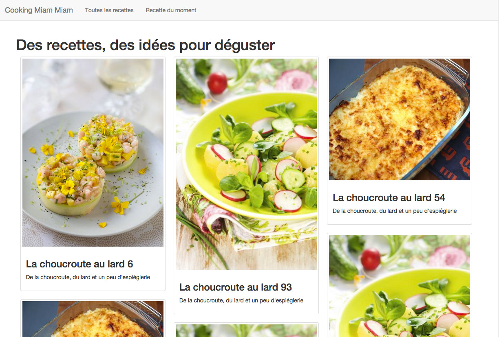

include::../../header.adoc[]

= Cooking Miam Miam
:stylesheet: ../../style.css

C'est un site de recettes de cuisine proposant un layout moderne et (un peu) responsive

.HTML, CSS, javascript, ergonomie...
****
Le but de ce projet est de discuter de problématiques serveur (backend).

Le code frontend est très en dessous de ce qui est exigible pour un vrai site professionnel.
****

== Sitemap

Voici l'ensemble des pages du site :

* pages publiques : accès aux pages de liste et recettes
* pages d'admin : permet l'édition des recettes

.Pages publiques

[ditaa, 'public', align="center"]
....
       +-------+
       |{d}    |
       |       | ------------------\
       | index |                   |
       +-------+                   |
           |                       |
    /------+------\                |    +-------+
    |             |                |    |{d}    |
    v             v                +--->|       |
+-------+    +--------+            |    |recette|
|{d}    |    |{d}     |            |    +-------+
|       |    |recettes|            |
| liste |    |   du   |------------+
|       |    | moment |            |
+-------+    +--------+            |
    |                              |
    \------------------------------/
....

.Pages d'admin

[ditaa, 'admin', align="center"]
....
+-------+          +-------+          +-------+
|{d}    |          |{d}    |          |{d}    |
|       | -------->|       | -------->|edition|
| index |          | liste |          |recette|
+-------+          +-------+          +-------+
....

== État de l'application

En l'état, l'applicaton démarre en local dans un environnement de développement.

Elle est fonctionnelle mais truffée de bugs et incomplète.

On va donc

* corriger tous les bugs,
* et rajouter les fonctionnalités manquantes.

include::../../footer.adoc[]