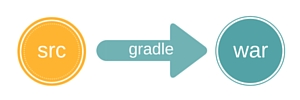

include::../../header.adoc[]

= Architecture de l'application
:stylesheet: ../../style.css

== Vision globale

L'architecture est composée d'une application web qui est reliée à une base de données mongodb.

[ditaa, 'architecture', align="center"]
....
/-------\      +-------+
|       |      |{s}    |
|web app| ---> | mongo |
|       |      |       |
\-------/      +-------+
....

L'application est en java et est packagée sous le format standard *war*.

Mongodb est une base NOSQL qui stocke des documents en format BSON (Binary JSON).

== Technology stack

Voici la liste des principales technologies utilisées dans notre projet.

****
[.float-group]
--
image::java.png[width="100",role="left"]

Java est un language de programmation orienté objet.

Java, c'est aussi la jvm qui permet de faire tourner les programmes et le jdk qui contient la librairie standard et le compilateur.

Java Enterprise Edition (JEE) est un ensemble de librairies supplémentaires et outils pour le développement d'applications.
--
****

****
[.float-group]
--
image::gradle.png[width="100",role="left"]

https://gradle.org/[Gradle, window="_blank"] est un outils de build pour beaucoup de languages (java, groovy, scala, c...)

Il se configure à l'aide d'un language spécifique (DSL) en groovy

Il est plus récent et plus souple que son concurent principal : maven
--
****

****
[.float-group]
--
image::Tomcat.png[width="100",role="left"]

http://tomcat.apache.org/[Tomcat, window="_blank"] est un serveur web pouvant lancer des applications web java.

Il est open source et offre de très bonnes performances.

C'est celui que l'on va utiliser pour le développement.
--
****

****
[.float-group]
--
image::spring.png[width="100",role="left"]

http://projects.spring.io/spring-framework/[Spring, window="_blank"] est un framework par injection de dépendances (DI).

Spring a aussi un module MVC pour le web, que nous utilisons.
--
****

****
[.float-group]
--
image::mongo.jpg[width="100",role="left"]

https://www.mongodb.org/[MongoDB, window="_blank"] est une base données NOSQL orientée document.

Un document est un arbre json qui est stocké en Binary JSON (BSON).

Ce sont des structures souples, sans schéma.
--
****

****
[.float-group]
--
image::bootstrap.png[width="100",role="left"]

https://getbootstrap.com/[Bootstrap, window="_blank"] est un framework html, css et javascript pour développer des pages responsives.

Développé initialement en interne chez twitter, il est aujourd'hui très largement utilisé.
--
****

****
[.float-group]
--
image::jquery.png[width="100",role="left"]

http://jquery.com/[jquery, window="_blank"] est un framework javascript très populaire.

Il est simple mais néanmoins très puissant.

Il est utilisé par certaines fonctionnalités de bootstrap.
--
****

== Structure de projet standard

Maven a introduit le https://maven.apache.org/guides/introduction/introduction-to-the-standard-directory-layout.html[Standard Directory Layout, window="_blank"] : c'est une façon standard d'organiser ses sources.

Gradle suit ce standard :

[source]
----
src <1>
├─ main <2>
|  ├─ [language 1] <3>
|  ├─ [language 2]
└─ test <4>
   ├─ [language 1]
   ├─ [language 2]
----
<1> toutes les sources
<2> le code de l'application
<3> le code est segmenté par language
<4> le code des test

IMPORTANT: *Convention over configuration* : cette arborescence est une convention, si on la suit, il n'y a pas besoin de configuration.

Dans notre cas, pour une *application web* JEE :

[source]
----
src
├─ main
|  ├─ java <1>
|  ├─ resources <2>
|  └─ webapp <3>
|     ├─ WEB-INF <4>
|     └─ META-INF <5>
└─ test
   ├─ java
   └─ resources
----
<1> notre code en java
<2> les fichiers qui vont aussi dans le classpath
<3> les fichiers qui vont à la racine de l'application web
<4> fichiers de configuration protégés
<5> fichiers de méta données protégés

Cette distribution est pratique pour le développement.

[NOTE]
====
Au build, gradle va compiler les classes java et produire le war.

La structure à l'intérieur du war suit un standard qui est compris par les conteneurs de servlets tels que tomcat.

====

== Structure logicielle de l'app

L'application a une structure traditionnelle MVC pour le web.

[ditaa, 'mvc-simple', align="center"]
....
                                                                                 +----------+
                              +-------------------+     +------------------+     |{s}       |
                              |                   |     |                  |     |          |
                        +---->+    Controllers    +---->+     Services     +---->+          |
                        |     |                   |     |                  |     |   Base   |
+------------------+    |     +-------------------+     +------------------+     |          |
|                  |    |                                                        |          |
|     request      +----+                                                        +----------+
|    dispatcher    |    |
|                  |    |     +-------------------+
+------------------+    |     |                   |
                        +---->+     JSP views     |
                              |                   |
                              +-------------------+
....

Le rôle des composants :

* *request dispatcher* : il est fournit par le framework. Il 'dispatch' les requêtes entrantes vers les bons controllers / vues.
* *controllers* : ils recoivent la requête, utilisent les services et préparent les données.
* *services* : on y range la logique métier.
* *JSP views* : ce sont les templates qui produisent le html.

Cette division permet d'utiliser la technologie la plus adaptée pour chaque tâche.

== Vue séquentielle

En pratique chaque composant est appelé dans un ordre bien précis afin de remplir son role.

Voici la vision complète

include::../../partie-3/B-mvc/mvc.adoc[]

== Tests et TDD

L'application peut disposer de plusieurs types de tests

* tests unitaires : test d'un composant isolé
* tests d'intégration : test mettant en jeu plusieurs composant et potentiellement la base de données
* tests d'interface : simulation au travers d'un navigateur

Ces tests couvrent les points importants de l'application et nous assurent un meilleur niveau de qualité.

Malheureusement, dans le projet actuel, la couverture de test est très insuffisante.

include::../../footer.adoc[]