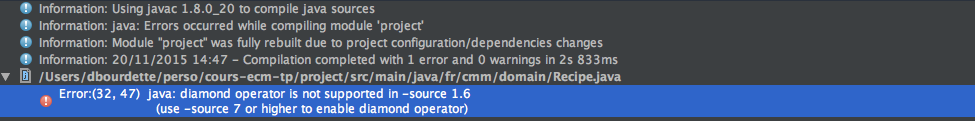

include::../../header.adoc[]

= Récupération du projet
:stylesheet: ../../style.css

Le code source du projet est sous github https://github.com/dbourdette/cours-ecm

== Fork

Il ne sera pas possible de travailler directement dans ce repository (vous n'avez pas les droits).

Github permet de rappatrier simplement un repository vers son compte en faisant un *fork*.

NOTE: le guide complet du fork de github : https://help.github.com/articles/fork-a-repo/

⇰ Simplement, depuis https://github.com/dbourdette/cours-ecm, il suffit d'appuyer sur le bouton fork.

image:fork_button.jpg[Fork]

== Clone

⇰ Une fois que le fork est fait, il suffit de faire un clone afin de récupérer le projet en local.

[source.terminal]
----
projects$ git clone https://github.com/{username}/cours-ecm.git <1>
projects$ cd cours-ecm
cours-ecm$
----
<1> On récupère le code de son fork

Vous avez maintenant le code source en local.

Le projet est divisé en 2 parties :

* docs : qui contient le source de cette documentation
* project : qui contient le code source du site

== gradle tomcatRun

IMPORTANT: il faut que la base mongodb soit lancée (`mongod --dbpath mongodb-data`) pour que l'application démarre avec succès

⇰ A la racine on peut lancer le site :

[source.terminal]
----
cours-ecm$ gradle tomcatRun

> Task :project:tomcatRun
Started Tomcat Server
The Server is running at http://localhost:8080
<=========----> 75% EXECUTING [28s]
> :project:tomcatRun
----

tomcatRun est une tâche qui a été ajoutée par le plugin `com.bmuschko.tomcat`.

[source]
.fichier build.gradle
----
plugins {
    id "com.bmuschko.tomcat" version "2.5"
}
----

Cette tâche lance un serveur tomcat et y place notre application à la volée.

⇰ Notre site est donc disponible sur http://localhost:8080/

== Structure de notre projet

Notre projet reprend la structure classique des applications web java.

On y retrouve, en plus, quelques fichiers relatifs aux frameworks utilisés.

[source.terminal]
----
src
├─ main
|  ├─ java                          // nos classes java
|  |  └─ fr
|  |     └─ cmm                     // fr.cmm notre package de base
|  |        ├─ controller           // nos controllers
|  |        ├─ domain               // classes qui définissent notre domaine
|  |        ├─ helper               // classes utilitaires
|  |        ├─ service              // les services
|  |        ├─ SpringConfig.java    // la configation de spring
|  |        └─ SpringProfiles.java  // les profils d'éxécution
|  └─ webapp                        // les fichiers qui vont à la racine de l'application web
|     ├─ css                        // les feuilles de style
|     ├─ js                         // notre javascript
|     ├─ lib                        // les librairies front (importées via bower)
|     └─ WEB-INF                    // fichiers de configuration protégés
|        ├─ jsp                     // les templates jsp
|        ├─ tags                    // les tag files (morceaux de template)
|        ├─ spring-servlet.xml      // configuration web de spring
|        └─ web.xml                 // configuration web d'une application jee
└─ test
   ├─ java
   └─ resources
.bowerrc                            // fichier de configuration de bower
bower.json                          // fichier de configuration de bower
build.gradle                        // fichier de configuration de gradle
gradle.properties                   // propriétés du build gradle
----

Malgré la faible taille de notre projet, cela fait déjà pas mal de fichiers.

NOTE: Le développeur de cette application a utilisé https://bower.io/[bower, window="_blank"] afin de récupérer les librairies front (bootstrap et jquery)
https://yarnpkg.com/fr/[yarn, window="_blank"] serait une alternative plus récente et plus riche.

A partir d'ici, il va falloir intervenir à différents endroits afin de corriger ou ajouter des fonctionnalités à notre application.

== Import sous Intellij

⇰ Dans intellij faire un File[New > Project from Existing Sources...] et choisir le build.gradle à la racine du projet (contenant les répertoires docs et project).

.Résultat (probable) de l'import
image:import.png[Import sous Intellij]

== Bootstrap de la base

La classe `FillDatabaseWithRandomTask`, dans le package `fr.cmm.boot` des tests, permet de remplir la base avec des données de test.

[source,java]
----
@Test
public void fillDbWithRandomRecipes() throws IOException {
    recipeCollection.remove();

    for (int i = 0; i < 100; i++) {
        recipeCollection.insert(randomRecipe());
    }
}
----

NOTE: Afin de naviguer rapidement vers une classe, il est possible d'utiliser le raccourci kbd:[⌘+n]

⇰ Exécutez ce test afin de remplir la base locale.

image:exec.png[Exécution du test]

IMPORTANT: Il faut faire tourner le test en direct et non au travers de gradle (symbole gradle dans les 2 éléments du menu Run)

Il se peut que vous ayez l'erreur suivante.

Il faut alors juste changer le niveau de language supporté dans les preférences image:prefs.png[] du projet.

image:prefs-2.png[Préférences du language]

On doit alors obtenir une base remplie et à peu près le log suivant.

[source,terminal]
----
objc[30871]: Class JavaLaunchHelper is implemented in both /Library/Java/JavaVirtualMachines/jdk1.8.0_102.jdk/Contents/Home/bin/java (0x1024a84c0) and /Library/Java/JavaVirtualMachines/jdk1.8.0_102.jdk/Contents/Home/jre/lib/libinstrument.dylib (0x10252c4e0). One of the two will be used. Which one is undefined.
août 29, 2018 3:39:03 PM org.springframework.test.context.support.DefaultTestContextBootstrapper getDefaultTestExecutionListenerClassNames
INFOS: Loaded default TestExecutionListener class names from location [META-INF/spring.factories]: [org.springframework.test.context.web.ServletTestExecutionListener, org.springframework.test.context.support.DependencyInjectionTestExecutionListener, org.springframework.test.context.support.DirtiesContextTestExecutionListener, org.springframework.test.context.transaction.TransactionalTestExecutionListener, org.springframework.test.context.jdbc.SqlScriptsTestExecutionListener]
août 29, 2018 3:39:03 PM org.springframework.test.context.support.DefaultTestContextBootstrapper instantiateListeners
INFOS: Could not instantiate TestExecutionListener [org.springframework.test.context.transaction.TransactionalTestExecutionListener]. Specify custom listener classes or make the default listener classes (and their required dependencies) available. Offending class: [org/springframework/transaction/interceptor/TransactionAttributeSource]
août 29, 2018 3:39:03 PM org.springframework.test.context.support.DefaultTestContextBootstrapper instantiateListeners
INFOS: Could not instantiate TestExecutionListener [org.springframework.test.context.jdbc.SqlScriptsTestExecutionListener]. Specify custom listener classes or make the default listener classes (and their required dependencies) available. Offending class: [org/springframework/transaction/interceptor/TransactionAttribute]
août 29, 2018 3:39:03 PM org.springframework.test.context.support.DefaultTestContextBootstrapper getTestExecutionListeners
INFOS: Using TestExecutionListeners: [org.springframework.test.context.web.ServletTestExecutionListener@2133c8f8, org.springframework.test.context.support.DependencyInjectionTestExecutionListener@43a25848, org.springframework.test.context.support.DirtiesContextTestExecutionListener@3ac3fd8b]
août 29, 2018 3:39:03 PM org.springframework.context.support.GenericApplicationContext prepareRefresh
INFOS: Refreshing org.springframework.context.support.GenericApplicationContext@6615435c: startup date [Wed Aug 29 15:39:03 CEST 2018]; root of context hierarchy
août 29, 2018 3:39:04 PM org.springframework.beans.factory.annotation.AutowiredAnnotationBeanPostProcessor <init>
INFOS: JSR-330 'javax.inject.Inject' annotation found and supported for autowiring
août 29, 2018 3:39:05 PM org.springframework.context.support.GenericApplicationContext doClose
INFOS: Closing org.springframework.context.support.GenericApplicationContext@6615435c: startup date [Wed Aug 29 15:39:03 CEST 2018]; root of context hierarchy

Process finished with exit code 0
----

NOTE: Si le site est arrêté, il faut le relancer via `gradle tomcatRun`

On peut maintenant aller voir les recettes sur http://localhost:8080[le site, window="_blank"].

⇰ Il est possible de jouer avec la méthode `randomRecipe()` afin d'obtenir d'autres recettes

include::../../footer.adoc[]