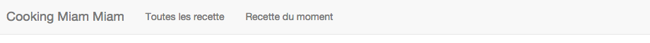

include::../../header.adoc[]

= Erreurs dans les templates JSP

Voici la liste des bugs répertoriés en relation avec les JSP

Les templates JSP sont les fichiers responsables de la mise en page HTML.

NOTE: Il n'est pas nécessaire de redémarrer le serveur tomcat avec `gradle tomcatRun` à chaque modification de jsp.

NOTE: link:../A-jsp/index.html[L'annexe A] couvre ce qu'il est possible de faire dans les jsp.

NOTE: Afin d'éditer les recettes, il faut utiliser l'interface d'admin sur http://localhost:8080/admin[/admin, window = _blank]

NOTE: Vous pouvez vous amuser à faire un commit après chaque correction afin d'avoir un https://git-scm.com/docs/git-log[git log, window="_blank"] le plus propre possible

NOTE: j'arrête les points d'info

== JSP-1 : il manque un 's' dans l'entrée "Toutes les recette" du menu

Il manque un 's' à "Toutes les recette" dans le menu de toutes les pages.

Les templates jsp sont dans `src/main/webapp/WEB-INF/jsp`

⇰ Trouvez tous les templates concernés et corrigez les.

== JSP-2 : le lien vers les mentions légales est incorrect

Dans le footer, le lien vers les mentions légales n'est pas bon.

image::footer.png[]

⇰ Il devrait pointer sur /mentions-legales

Le footer a été partagé entre les templates au travers d'un tag file.

== JSP-3 : format de la date dans recette.tag

Dans le tag file qui affiche une recette, on trouve `
${receipe.date}
`

La propriété date d'une recette est de la classe `java.util.Date`.

Comme il faut obtenir une chaîne de caractère, la jsp utilise la méthode `Date.toString()` qui donne par exemple.

image::jsp-3.png[]

Ce n'est pas très lisible.

⇰ Il faut formatter avec le pattern suivant `dd MMM yyyy` (voir les http://docs.oracle.com/javase/7/docs/api/java/text/SimpleDateFormat.html[patterns pour les dates])

Regardez dans link:../A-jsp/index.html[l'annexe A] le custom tag formatDate de la JSTL. Vous pouvez aussi chercher sur le web.

== JSP-4 : liste des tags avec forEach

Dans la jsp qui affiche une recette, il y a la liste des tags associés à une recette.

Actuellement, la liste est affiché comme cela : `${fn:escapeXml(recipe.tags)}`.

La propriété tags d'une recette est une liste (`List<String>`).

Cela donne donc quelque chose comme image:tags.png[] si il y a plusieurs tags.

On voudrait plutôt faire une boucle sur les tags afin d'obtenir le code suivant :

[source,html]
----
choucoutealsace
    

        

            <button type="button" class="navbar-toggle collapsed" data-toggle="collapse" data-target="#navbar-collapse">
                Toggle navigation
                
                
                
            </button>
            <a class="navbar-brand" href="/">Cooking Miam Miam</a>
        

        

            <ul class="nav navbar-nav">
                <li><a href="/recettes">Toutes les recette</a></li>
                <li><a href="/recette-du-moment">Recette du moment</a></li>
            </ul>
        

    

</nav>
----

Ce n'est pas bien car si on doit le changer, il faut le faire dans tous les fichiers.

.DRY
****
La duplication de code est l'un des pire enemis du développeur.

Le principe *DRY* (Don't Repeat Yourself) énonce que "Every piece of knowledge must have a single, unambiguous, authoritative representation within a system."

Sans cela, la maintenance d'un logiciel est un enfer.
****

⇰ La meilleure façon de factoriser est via un *fichier tag* comme pour le header.

Au passage, il est même possible de passer un paramètre depuis chaque page afin de rendre actif un élément de la navigation.

link:../A-jsp/index.html[L'annexe A] décrit le fonctionnement des tag files.

Voir également la doc https://getbootstrap.com/components/#navbar[Bootstrap] afin de rendre un élément actif.

== JSP-6 : format du texte dans recette.tag

Dans la page de recette, si la recette possède un texte sur plusieurs lignes comme ceci :

.exemple de texte sur plusieurs lignes
----
du texte
du texte
du texte
et encore du texte.
----

Il s'affiche sur une seule ligne dans le navigateur.

Le code responsable dans la jsp est `
${fn:escapeXml(recipe.text)}
`

La fonction escapeXml nous permet de bien gérer les <, > et & qui sinon risqueraient de casser notre code html.

.HTML Entities
****
Some characters are reserved in HTML.

If you use the less than (<) or greater than (>) signs in your text, the browser might mix them with tags.

Character entities are used to display reserved characters in HTML.

source http://www.w3schools.com/html/html_entities.asp
****

Mais elle ne transforme pas les retours chariot (\n) en  .

Il est possible de chainer les opérations afin d'arriver au résultat en utilisant une fonction replace de la jstl. Ce serait très inélégant.

Il vaut mieux de créer notre propre fonction qui fait les 2 opérations pour un seul appel depuis la jsp.

Pour faire cela :

* ⇰ il faut ajouter un package fr.cmm.tags dans src/main/java
* ⇰ il faut ajouter une classe Functions.java dans le package
* ⇰ il faut ajouter une méthode *statique* publique dans la classe java qui prend un String en paramètre et renvoie un String
* ⇰ il faut bien sûr ajouter des tests unitaires dans une classe fr.cmm.tags.FunctionsTest dans src/test/java.
* ⇰ il faut ajouter une tld avec la fonction dans WEB-INF/tld
* ⇰ il faut déclarer la tld dans la jsp
* ⇰ il faut changer l'appel de excapeXml par notre méthode

Voici quelques exemples de tests 

[source,java]
----
assertEquals("a", Functions.text("a"));
assertEquals("a ", Functions.text("a\n"));
assertEquals("&amp;a", Functions.text("&a"));
----

Pour l'impémentation, on peut utiliser https://commons.apache.org/proper/commons-lang/javadocs/api-3.3/org/apache/commons/lang3/StringEscapeUtils.html[StringEscapeUtils.escapeXml10(String)] et https://commons.apache.org/proper/commons-lang/javadocs/api-3.3/org/apache/commons/lang3/StringUtils.html[StringUtils.replace(String, String, String)] qui sont déjà présents dans notre projet.
Pour les retours chariots, il faut faire un replace des `"\n"` par des ` `

link:../A-jsp/index.html[L'annexe A] décrit le fonctionnement des fichiers tld et des fonctions.

== JSP-7 : auto complétion des tags

Lorsqu'on édite une recette, il devrait y avoir de l'autocomplétion sur le champs tags.

Cette fonctionnalité est mise en place au chargement de la page dans le code javascript présent dans le projet.

La liste complète des tags est un service offert par l'``IndexController`` via le mapping '/tags.json'.

En l'état, cela ne fonctionne pas.

⇰ En étudiant le html et le javascript, ajoutez ce qu'il faut dans le html afin de faire fonctionner l'autocomplétion sur les tags.

.tokenfield
****
Afin de proposer l'autocomplétion sur les tags, le projet utilise http://sliptree.github.io/bootstrap-tokenfield/[bootstrap-tokenfield].

Cette librairie a été téléchargée dans notre projet au travers de http://bower.io/[bower].
****

.data-* attributes
****
Les https://developer.mozilla.org/en-US/docs/Web/Guide/HTML/Using_data_attributes[data-* attributes] permettent de stocker de l'information en respect des normes.

Ils sont pratiques afin de ranger des données qui ne correspondent à aucun attribut standard.
****

== JSP-8 : ajouter du sel et du poivre

Pour gagner du temps, dans l'interface d'édition, le client aurait voulu un bouton 'ajouter du sel' et 'ajouter du poivre'.

⇰ En étudiant le javascript du site et le fichier ingredient-form-row.jsp, ajoutez les boutons 'sel' et 'poivre' nécessaires.

NOTE: La page /admin/recettes/ingredientFormRow accèpte un ingredientIndex en paramètre. En regardant le code de la jsp `ingredient-form-row.jsp`, on peut voir que l'on peut aussi utiliser le paramètre ingredientName qui peut nous servir ici.

== JSP-9 : index dans les tableaux d'ingrédients

Lorsque l'on ajoute des ingrédients puis on en retire, on arrive avec le html suivant :

[source,html]
.ingredients
----

 

 

 

 

  

   

    <input type="text" class="form-control" placeholder="Nom" name="ingredients[3].name" value="">
   

   

    <input type="text" class="form-control" placeholder="Quantité" name="ingredients[3].quantity" value="">
   

   

    <input type="text" class="form-control" placeholder="Unité" name="ingredients[3].unit" value="">
   

   

    <button type="button" class="btn btn-default" data-role="removeIngredient"></button>
   

  

 

 

  

   

    <input type="text" class="form-control" placeholder="Nom" name="ingredients[5].name" value="">
   

   

    <input type="text" class="form-control" placeholder="Quantité" name="ingredients[5].quantity" value="">
   

   

    <input type="text" class="form-control" placeholder="Unité" name="ingredients[5].unit" value="">
   

   

    <button type="button" class="btn btn-default" data-role="removeIngredient"></button>
   

  

 

 

  

   

    <input type="text" class="form-control" placeholder="Nom" name="ingredients[6].name" value="">
   

   

    <input type="text" class="form-control" placeholder="Quantité" name="ingredients[6].quantity" value="">
   

   

    <input type="text" class="form-control" placeholder="Unité" name="ingredients[6].unit" value="">
   

   

    <button type="button" class="btn btn-default" data-role="removeIngredient"></button>
   

  

 

----

On peut voir que le tableau d'ingrédients (`ingredients[x]`) à des trous (ici on a encore les index 3, 5 et 6)

Ces données vont partir vers le serveur qui va remplir une liste de 6 éléments avec 3 trous.

Si on sauve, on va donc récupérer 3 lignes de données vides :

image::ingredients-index.png[align=center]

Que faudrait il faire pour corriger ce problème ?
Vaudrait il mieux le faire coté client ou serveur ?

.RIA
****
Ce petit exemple de formulaire avec une liste dynamique démontre que les frameworks classiques comme Spring MVC sont mal à l'aise avec ce genre de problème.

Envoyer les données en JSON via une mécanique AJAX réglerait plus facilement ce problème.

Les frameworks pour les Rich Internet Applications (RIA) comme Angular traiteraient de ce problème beaucoup plus aisément.
****

IMPORTANT: Le but ici est d'imaginer une solution, pas de la coder.

== JSP-10 : pagination

Dans `recettes.jsp` (visible depuis /recettes) il y a une pagination qui n'est pas fonctionnelle pour le moment.

image::bad-pagination.png[align=center]

Le code est `${pagination.pages}`.

La classe `Pagination` est dans le package `fr.cmm.helper` (getPages() est codé en dur, mais ce n'est pas le sujet pour le moment).

En se servant de tout ce qui a été vu précédemment, formattez cette pagination en utilisant le https://getbootstrap.com/components/#pagination[composant pagination de bootstrap]

image::pagination.png[align=center]

NOTE: Le pattern afin de naviguer dans les pages est `/recettes?pageIndex=${index}`

Afin d'avoir de l'autocomplétion pour la pagination dans la jsp, il est possible d'ajouter dans la jsp :

[source]
----
<%--@elvariable id="pagination" type="fr.cmm.helper.Pagination"--%>
----
