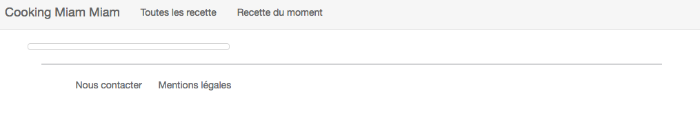
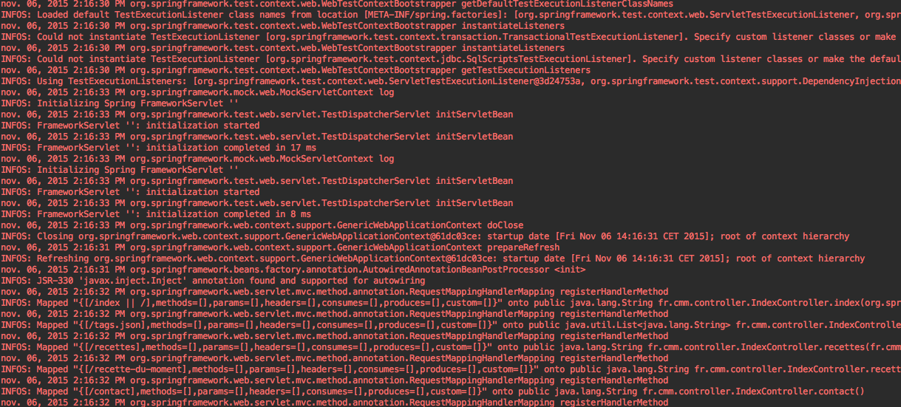
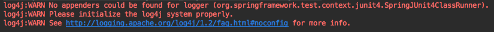
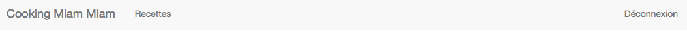

include::../../header.adoc[]

= Bugs dans les controllers MVC

Voici la liste des bugs répertoriés en relation avec le MVC

NOTE: Les modifications dans les controllers nécessitent de redémarrer le serveur avec `gradle tomcatRun`.

NOTE: link:../B-mvc/index.html[l'annexe B] résume les concepts liés au MVC pour le web

== MVC-1 : Page contact cassée

Le lien "Nous contacter" dans le footer fait une 404

image::404.png[align=center]

⇰ Corrigez la classe `IndexController` afin que ce lien fonctionne.

⇰ Il y a des tests en place pour `IndexController` dans la classe `IndexControllerTest`, profitez en pour rajouter un test pour cette méthode `contact()`.

NOTE: link:../B-mvc/index.html[L'annexe B] couvre les tests des Controllers avec MockMvc.
Pour `IndexControllerTest` on a aussi utilisé une librairie de mock : http://mockito.org/[Mockito].
Elle permet de simuler RecipeService et donc, de ne pas avoir besoin d'une connexion à la base pour le test.

== MVC-2 : La recherche est perdue

Dans la page /recettes, si je fais une recherche les résultats s'affichent bien.

Par contre, la boite de recherche est vidée.

Par exemple sur /recettes?tag=alsace la boite de recherche est :

image::search-form.png[align=center]

⇰ Que faut il faire dans `IndexController` et dans `recettes.jsp` afin que le contenu de l'input soit conservé ?

== MVC-3 : pageIndex invalide

Lors de la recherche sur /recettes, le `SearchForm` possède un paramètre `pageIndex`.

Ainsi, on peut aller sur la page 2 via la requête /recettes?pageIndex=2

.1 based ou 0 based
****
Nous avons choisi d'utiliser un index partant de 1 pour la première page.

Nous avons fait cela car l'index est visible pour l'utilisateur et que commencer à 1 est plus logique pour un humain.

Attention, les APIs commencent généralement à 0, ce qui peut engendrer bon nombre de problèmes.
****

Cependant, que se passe t il si un utilisateur change l'index à la main en mettant 0 ou un nombre négatif ?

.Une erreur affreuse
image::500-bad-index.png[align=center]

Notre code n'est pas du tout protégé...

⇰ Que peut on faire ?

== MVC-4 : Problème de pagination

La `Pagination` semble avoir un problème, elle ne semble pas indiquer toujours le bon nombre de pages.

Le code pour compter le nombre de pages est le suivant :

[source,java]
----
public int getPageCount() {
  return (int) count / pageSize;
}
----

Par exemple, si il y a 20 éléments en base et que pageSize vaut 50, `getPageCount()` va donner 0.

⇰ Ajoutez et faites passer des tests unitaires afin de couvrir les cas suivants :

* count est un multiple de pageSize
* count n'est pas un multiple de pageSize
* condition aux limites : count == 0

Doit on tester le cas pageSize == 0 ?

.Tests unitaires
****
Certains tests peuvent paraitre inutiles puisque le code fonctionne déjà.

Oui mais une fois les tests en place, ils assureront qu'il n'y a pas de régression.

Avec de l'intégration continue, chaque commit relance les tests : on saura immédiatement que le build est cassé.
****

== MVC-5 : getPages() dans Pagination

Pas loin de la méthode `getPagesCount()` de MVC-4, on peut voir que le résultat de `getPages()` est hardcodé.

[source,java]
----
public List getPages() {
    return asList(1, 2, 3, 4, 5, 6, 7, 8, 9, 10);
}
----

⇰ En passant par des tests unitaires, faire une impémentation correcte de cette méthode.

Le fonctionnement souhaitée pour la navigation est de se construire autour de l'index courant en essayant de mettre jusqu'a 10 éléments.

.Test driven
****
Il n'est pas facile de deviner quel sera le bon algorithme.

En commençant par des cas simples, grâce aux tests, on construit la solution par petits bouts.

Un fois en place, les tests nous permettront de retoucher (refactoring) le code en s'assurant qu'on ne casse rien.
****

.Magic number
****
La pagination fait au plus 10 éléments. Ce chiffre risque d'apparaitre plusieurs fois dans le code.

Cela ne va pas sembler évident à quelqu'un venant relire le code.

Afin d'éviter ce sentiment d'un chiffre venu de nul part, il est bon d'en faire une constante dans la classe `Pagination`
[source,java]
----
public static final int PAGINATION_SIZE = 10;
----
****

== MVC-6 : Recette inconnue

Pour le moment, on a très peu de gestion d'erreur.

Si on va sur http://localhost:8080/recette/56375619d4c603aa4eb412dd on obtient une page très vide et qui semble cassée.

Dans ce cas, on voudrait obtenir une 404 (page not found).

image::404-no-title.png[]

⇰ En passant par les tests, s'assurer que l'obtient bien une 404 depuis `IndexController` lorsque la recette n'existe pas.

.Mockito
****
Afin de ne pas avoir à remplir la base pour les tests, on utilise la librairie Mockito.

Elle permet d'obtenir un faux RecipeService que l'on va pouvoir piloter depuis le test.

Cela permet donc de tester notre IndexController en isolation du reste de notre code.
****

Comment retourner une 404 depuis un Controller ? On pourra http://lmgtfy.com/?q=return+404+spring+mvc[s'aider de google].

== MVC-7 : Pages 404 et 500

Actuellement, nos pages 404 (ex: /plop) et 500 (ex: /recette/plop) sont affreuses : ce sont les pages par défaut de tomcat.

Elles affichent les stacktraces, ce qui est bien pratique, mais pour le visiteur du site, c'est moche.

⇰ Nous allons donc ajouter des pages d'erreur plus jolies.

[source,xml]
.Gestion d'erreur dans le web.xml
----
<!-- Error pages handling -->
<error-page>
    <error-code>404</error-code> <1>
    <location>/404</location>
</error-page>
<error-page>
    <error-code>500</error-code> <2>
    <location>/500</location>
</error-page>
----
<1> En cas d'erreur 404, on redirige vers la page /404
<2> En cas d'erreur 500, on redirige vers la page /500

Cette gestion d'erreur se fait au niveau conteneur de Servlet (tomcat).

⇰ Or notre servlet Spring est mappée sur `/` (normalement, ça veut dire 'tout'), mais tomcat manque un peu d'intelligence, il faut rajouter les mappings suivant :

[source,xml]
.Mapping supplémentaire pour la Servlet Spring
----
<servlet-mapping>
  <servlet-name>spring</servlet-name>
  <url-pattern>/404</url-pattern>
</servlet-mapping>
<servlet-mapping>
  <servlet-name>spring</servlet-name>
  <url-pattern>/500</url-pattern>
</servlet-mapping>
----

⇰ Ajoutez ces entrées ainsi que les `@RequestMapping` correspondant dans `IndexController`

⇰ Enfin, ajoutez le fichier jsp qui affiche un message d'excuse. Un seul fichier jsp peut servir pour les 2 cas.

Maintenant, http://localhost:8080/recette/56375619d4c603aa4eb412dd doit retourner une page d'erreur présentable.

image::404-nice.png[]

== MVC-8 : Messages de validation

A l'édition d'une recette, si on ne met pas le titre ou la date, on obtient une erreur :

image::validation-error.png[align=center]

C'est `AdminController` qui fait la gestion d'erreur.

[source,java]
.Handler de post du formulaire
----
@RequestMapping(value = "/recettes/edit", method = POST)
public String post(@ModelAttribute("command") @Valid Recipe recipe, BindingResult result, RedirectAttributes redirectAttributes) {
  if (result.hasErrors()) { <1>
    return "admin/recipe/form";
  }

  recipeService.save(recipe);

  redirectAttributes.addFlashAttribute("flashMessage", "La recette a été sauvée"); <2>

  return "redirect:/admin/recettes/edit?id=" + recipe.getId(); <3>
}
----
<1> En cas d'erreur, on affiche la vue de nouveau
<2> En cas de succès, on ajoute un message flash
<3> Redirect after POST

.addFlashAttribute(name, value)
****
Le scope flash est une zone qui contient des données qui seront disponibles uniquement lors de la prochaine requête.

Il permet donc d'y ranger des objets juste avant un redirect.

L'alternative serait de mettre des paramètres dans l'url du redirect, ce qui serait moins joli.
****

Puis la jsp affiche les erreurs présentes

[source,xml]
.Affichage de l'erreur pour le title
----
<spring:bind path="title"> <1>
  
 <2>
    <label class="control-label" for="title">Titre ${fn:escapeXml(status.errorMessage)}</label> <3>
    <form:input cssClass="form-control" id="title" placeholder="Titre" path="title" />
  

</spring:bind>
----
<1> On indique à spring qu'on va travailler sur le champs 'title' afin d'avoir accès aux erreurs pour ce champs
<2> Classe css 'has-error' en cas d'erreur
<3> Le message d'erreur à coté du nom du champs

Mais d'où vient le message "ne peut pas être vide" qui apparait ?

Il serait possible d'utiliser l'objet http://docs.spring.io/spring/docs/current/javadoc-api/org/springframework/validation/BindingResult.html[`BindingResult`] afin de gérer la validation nous même.

[source,java]
.Validation Manuelle
----
if (title == null || "".equals(title)) {
  result.rejectValue("title", "notEmpty", "est obligatoire");
}
----

Cependant nous avons choisi d'utiliser `@Valid` dans notre Controller. Cela permet d'utiliser les annotations de http://beanvalidation.org/[Bean Validation].

Dans notre `Recipe` nous avons donc :

[source,java]
.Bean Validation dans le modèle
----
@NotEmpty <1>
private String title;

@NotNull <2>
private Date date = new Date();
----
<1> Le titre ne peut pas être null ou vide
<2> La date ne peut pas être null

Les 2 approches (manuelle et Bean Validation) peuvent être combinées en fonction des besoins. Toutes les erreurs finissent dans BindingResult.

⇰ Trouvez comment avoir les messages d'erreur suivant : "Titre est obligatoire" et "Date est obligatoire".

Comment pourrait on faire si on souhaite ne pas pouvoir anti dater une recette, uniquement à la création de celle ci ? (c'est une question assez rhétorique, il y a peu de chance que cela soit intéressant dans notre cas).

== MVC-9 : Logs

Actuellement, nous n'avons rien fait afin de configurer les logs.

Lorsqu'on lance un test unitaire qui charge un contexte spring (ex: `RecipeServiceTest`), on peut voir les lignes suivantes :

C'est très verbeux car on a toutes les traces à partir du niveau INFO.

C'est en rouge parce que le code utilise la sortie error (stderr via `System.err`) par défaut.

Le problème en java est qu'il existe plusieurs (trop de) librairies de log (java.util.logging, log4j...).

Pour faire encore plus simple, il existe aussi des wrappeurs comme http://www.slf4j.org/[SLF4J] (Simple Logging Facade for Java) ou https://commons.apache.org/proper/commons-logging/[commons-logging]

.Librairies et wrappers
****
Il n'y avait pas de librairie de gestion de log aux débuts de java. Trop de librairies existent aujourd'hui.

En théorie, il faudrait configurer chaque librairie de log utilisée par notre code et nos dépendances.

En pratique, certaines librairies chapotent tout cela, comme slf4j ou logback.
****

Pour résumer, c'est joyeusement compliqué juste pour gérer les logs.

java.util.logging étant plus pauvre que log4j, la plupart des librairies utilisent log4j (ou log4j2) ou un wrapper (slf4j ou commons-logging).

=== Ajout de log4j

⇰ On commence par ajouter log4j à nos librairies

image::add-log4j.png[]

Il faut bien s'assurer que la librairie est bien présente ensuite dans la liste des dépendances du projet.

⇰ Si on relance notre test, on devrait voir :

Log4j est actif mais mal configuré.

=== Configuration

Il existe plusieurs façon de configurer log4j.

On va passer par un fichier `log4j.properties` à la racine du classpath.

⇰ Il suffit donc de rajouter ce fichier dans `src/test/resources` :

.log4j.properties
----
log4j.rootLogger=ERROR, console <1>

log4j.appender.console=org.apache.log4j.ConsoleAppender <2>
log4j.appender.console.layout=org.apache.log4j.PatternLayout <3>

log4j.appender.console.layout.ConversionPattern=%5p [%t] (%F:%L) - %m%n <4>

----
<1> Définition du root logger en niveau ERROR avec l'identifiant 'console' comme appender (sortie)
<2> L'appender 'console' va écrire via le ConsoleAppender (System.out et System.err)
<3> la sortie de 'console' est formattée avec un pattern
<4> Format de la sortie

.Configuration
****

Il existe de très nombreuses options de Configurartion.

On peut écrire dans un fichier, des fichiers roulants, un service réseau, en base...

****

Les logs en rouge doivent avoir disparu.

Il est possible (et recommandé) de faire de même pour l'application en production.
Par exemple, on pourrait mettre un fichier de configuration log4j dans `src/main/resources` qui partirait dans le war.

== MVC-10 : Sécurisation

Actuellement, tout le monde peut accéder à /admin et donc administrer notre site.

La librairie la plus complète pour ce genre de besoin est http://projects.spring.io/spring-security/[spring security]. Comme son nom peut le laisser entendre, elle se marie assez bien avec un projet spring.

=== Ajout de spring-security

⇰ Comme pour log4j, on rajoute la librairie

[source]
.build.gradle
----

compile 'org.springframework.security:spring-security-core:4.0.3.RELEASE'
compile 'org.springframework.security:spring-security-config:4.0.3.RELEASE'
compile 'org.springframework.security:spring-security-web:4.0.3.RELEASE'

----

Il faut penser à recharger le projet dans l'onglet gradle.

=== Ajout de l'intercepteur

⇰ Il faut demander à Spring security d'intercepter toutes les requêtes en ajoutant dans le web.xml :

[source,xml]
.web.xml
----
<filter>
    <filter-name>springSecurityFilterChain</filter-name>
    <filter-class>org.springframework.web.filter.DelegatingFilterProxy</filter-class> <1>
</filter>
<filter-mapping>
    <filter-name>springSecurityFilterChain</filter-name>
    <url-pattern>/*</url-pattern> <2>
</filter-mapping>
----
<1> Le filtre spring security
<2> Intercepte toutes les requêtes

Le mieux est de placer ce filtre avant l'encoding-filter, afin qu'il soit traversé en premier. L'ordre dans le web.xml est important.

Ainsi, avant d'arriver sur la `DispatcherServlet`, les requêtes passeront au travers du `DelegatingFilterProxy`.

=== Ajout de la configuration

⇰ Il reste a configurer spring security en modifiant d'abord le web.xml (ajout de `fr.cmm.SpringSecurity`).

[source,xml]
.Modification du ContextLoaderListener dans le web.xml
----
<listener>
    <listener-class>org.springframework.web.context.ContextLoaderListener</listener-class>
</listener>
<context-param>
    <param-name>contextClass</param-name>
    <param-value>org.springframework.web.context.support.AnnotationConfigWebApplicationContext</param-value>
</context-param>
<context-param>
    <param-name>contextConfigLocation</param-name>
    <param-value>fr.cmm.SpringConfig, fr.cmm.SpringSecurity</param-value>
</context-param>
----

⇰ Et bien sûr la classe java correspondante

[source,java]
.fr.cmm.SpringSecurity
----
@Configuration
@EnableWebSecurity
public class SpringSecurity extends WebSecurityConfigurerAdapter {
    @Inject
    public void configureGlobal(AuthenticationManagerBuilder auth) throws Exception { <1>
        auth
            .inMemoryAuthentication() <2>
                .withUser("user").password("password").roles("ADMIN"); <3>
    }

    @Override
    protected void configure(HttpSecurity http) throws Exception { <4>
        http
            .authorizeRequests()
                .antMatchers("/admin/**").authenticated() <5>
                .and()
                .formLogin() <6>
                .and()
                .logout() <7>
                .logoutSuccessUrl("/")
                .logoutRequestMatcher(new AntPathRequestMatcher("/logout"));
}
----
<1> Configuration globale
<2> La base des utilisateurs est en mémoire. En production, nous aurions très certainement une base de données afin de stocker les utilisateurs.
<3> On ajoute un utilisateur avec le role ADMIN.
<4> Configuration des requêtes http
<5> /admin/** nécessite d'être authentifié
<6> Le login est disponible via un formulaire
<7> Gestion du logout.

Après reboot, lorsque l'on cherche a accéder à une page admin, on a le formulaire suivant.

image::auth-form.png[]

C'est bien, c'est pas très joli, mais on ne peut plus se déconnecter : )

== MVC-11 Déconnexion

Il est nécessaire de pouvoir se déconnecter. Nous allons ajouter un lien dans la navbar sur toutes les pages.

⇰ Afin de rajouter le lien de façon condionelle, nous utilisons la lib de https://docs.spring.io/spring-security/site/docs/current/reference/html/servlet-webclient.html#taglibs[customs tags pour spring security]

[source]
----
compile 'org.springframework.security:spring-security-taglibs:4.0.3.RELEASE'
----

⇰ Dans `header.tag` faites apparaitre un lien 'déconnexion' si l'utilisateur est `isAuthenticated()` à l'aide de la lib

[source,xml]
----
<%@ taglib prefix="sec" uri="http://www.springframework.org/security/tags" %>

...

<sec:authorize access="isAuthenticated()">
    ...
</sec:authorize>
----

La doc de bootstrap sur la navbar : https://getbootstrap.com/docs/3.3/components/#navbar

.CSRF
****
Afin de pouvoir utiliser un lien simple pour la déconnexion nous avons utilisé la config

[source]
----
.logoutRequestMatcher(new AntPathRequestMatcher("/logout"))
----

Cela désactive la protection Cross Site Request Forgery pour le logout.

C'est déconseillé par spring security. Il faudrait utiliser un formulaire plutôt qu'un lien.

Voir la doc sur le http://docs.spring.io/spring-security/site/docs/4.0.1.RELEASE/reference/htmlsingle/#csrf-logout[logout avec le filtre CSRF]
****

== MVC-12 Bouton 'éditer'

⇰ Si l'utilisateur est connecté et possède le role 'ADMIN', pourquoi ne pas lui ajouter un bouton éditer disponible depuis une recette ?

Cette fois, le contrôle de l'accès se fait avec `hasRole('ADMIN')`

.Autorisations
****
Ici, nous donnons des droits uniquement aux ADMINs.

Nous pourrions avoir d'autres types d'utilisateurs et profiter du login afin d'autoriser les commentaires, les notations, l'ajout de recettes pour les éditeurs...

Dans les jsp comme dans les contrôleurs, spring security permet de régler finement les autorisations.
****

== MVC-13 Formulaire de login

⇰ Actuellement, le formulaire de login est moche. En s'aidant de la doc http://docs.spring.io/spring-security/site/docs/4.0.1.RELEASE/reference/htmlsingle/#jc-form[spring security] et https://getbootstrap.com/docs/3.3/css/#forms[bootstrap] mettez en ligne un formulaire de login dans l'esprit du site.

