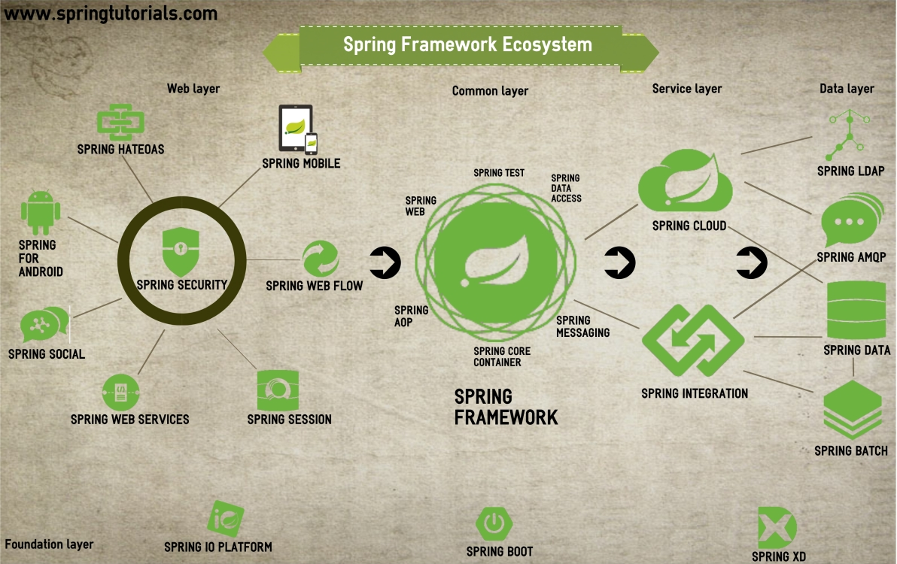
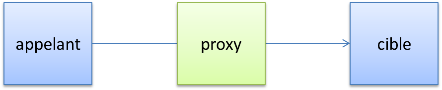

include::../../header.adoc[]

= Annexe C : L'injection de dépendances

Une application est un graphe de composants qui se référencent les uns les autres.

[align=center]
image::class-diagram.png[]

La construction de ce graphe n'est pas une tâche complexe mais rébarbative.

L'injection de dépendances (DI) permet d'automatiser celle ci.

Chaque composant devient plus autonome et plus simple à tester.

NOTE: Une composant Spring est aussi appelé Bean

== Spring framework

http://spring.io/projects/spring-framework/[Spring] est un framework d'injection de dépendances (et bien plus).

[NOTE]
====
Il existe d'autres frameworks d'injection de dépendances comme par exemple celui de google https://github.com/google/guice[Guice].

Le guide de Guice explique clairement la motivation derrière l'injection de dépendance : https://github.com/google/guice/wiki/Motivation
====

Mais Spring framework ne s'arrête pas à l'injection de dépendances.

[align=center]
image::spring-overview.png[]

Un framework qui fait partie d'un écosystème plus important.

[align=center]

Spring MVC n'est qu'un des composants de la famille Spring.

NOTE: http://spring.io/projects/spring-boot[Spring BOOT, window="_blank"] permet de démarrer rapidement avec spring MVC et les autres composants de spring.

== Exemple

Imaginons deux services qui collaborent.

[align=center]
image::spring-beans.png[]

L'annotation `@Inject` permet d'injecter un composant dans un autre composant.

[source,java]
----
public class SimpleService {
    @Inject
    private OtherService otherService;

    public void call() { otherService.doSomethingUseful(); }
}

public class OtherService {
    public void doSomethingUseful() { ... }
}
----

NOTE: @Inject est le standard java, spring supporte aussi sa propre annotation @Autowired et une autre annotation standard @Resource.

NOTE: Spring peut être configuré en xml ou via du code java. La version java est clairement encouragée.

== @Component

Il est possible de définir ses Beans dans la configuration ou bien de scanner le classpath.

[source,xml]
<!--scan le package x.y.z-->
<context:component-scan base-package="x.y.z"/>

Tous les composants annotés dans les packages sous x.y.z seront chargés.

[source,java]
----
@Service
public class OtherService {
   public void doSomethingUseful() { ... }
}

@Service
public class SimpleService {
   @Inject
   private OtherService otherService;

   public void call() { otherService.doSomethingUseful(); }
}
----

[NOTE]
====
`@Component` est l'annotation générique.

`@Service`, `@Repository` ou bien `@Controller` sont plus précis sémantiquement.
====

== Aspect Oriented Programming

La délégation de l'injection à spring offre la possibilté d'intercaler du code entre les appels.

[align=center]

Cette approche est appelée *Aspect Oriented Programming* et peut être mis en place de plusieurs façons :

* Création d'un *proxy dynamique* : création d'une classe à partir d'une interface (jdk)
* à la *compilation* : les aspects sont ajoutés au moment de la compilation
* au *chargement* : les aspects sont ajoutés au moment du démarrage de l'application.

C'est particulièrement utile afin de factoriser des traitements *orthogonaux* au code métier.

Malheureusement, la nomenclature de l'AOP est complexe : advice, crosscuting, join point, point cut...

C'est un outils puissant mais parfois difficile à manipuler.

=== Exemple : les transactions

La gestion d'une transaction sql est tâche répétitive et lourde à écrire

[source,java]
----
public void doSomethingUseful() {
    Connection con = null;

    try {
        con = dataSource.getConnection();
        con.setAutoCommit(false); // Activer les transactions

        // partie utile
        stmt = con.createStatement();
        stmt.executeUpdate("update my_table set stock = 3 where id = 15");

        con.commit(); // Commit de la transaction
    } catch (Exception e) {
        // Rollback de la transaction en cas d'erreur
        if (con != null) { con.rollback(); }
    } finally {
        // Libération des ressources
        if (con != null) { con.close(); }
    }
}
----

Grâce à l'AOP et un gestionnaire de transaction, on peut simplifier le code précédent.

[source,java]
----
@Transactional
public void doSomethingUseful() {
    Connection conn = DataSourceUtils.getConnection(dataSource);

    stmt = con.createStatement();
    stmt.executeUpdate("update my_table set stock = 3 where id = 15");
}
----

C'est maintenant le framework qui s'occupe de gérer la transaction et de libérer les ressources.
